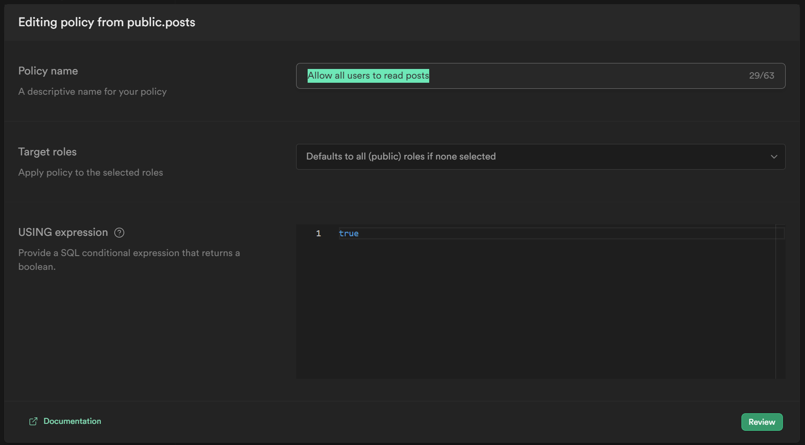

# Blueprint Astro Supabase

This is a blueprint for a hybrid site using Astro and Supabase.

## Table of Contents

- [Installation](#installation)
- [Guide](#guide)
- [Documentation](#documentation)
- [Contributing](#contributing)
- [License](#license)

## Installation

1. Clone the repository.
2. Install the dependencies by running the following command:

    ```bash
    npm install
    ```

## Guide

Based on the [Astro Supabase Starter](https://supabase.com/docs/guides/auth/server-side/creating-a-client?framework=astro&environment=astro-server) guide.

You can visit [Supabase & Astro](https://docs.astro.build/es/guides/backend/supabase/)

1. Create Astro project and follow the prompts

    ```bash
        npm create astro@latest
    ```


2. Install Supabase packages

    ```bash
        npm install @supabase/ssr @supabase/supabase-js
    ```

3. Set environment variables: Create a .env file in your project root directory. You can get your SUPABASE_URL and SUPABASE_ANON_KEY from inside your [Supabase project's dashboard](https://supabase.com/dashboard/project/_/settings/api).

    ```html
        SUPABASE_URL="https://<your-project-id>.supabase.co"
        SUPABASE_ANON_KEY="<your-public-api-key>"
    ```
4. By default, Astro apps are static. This means the requests for data happen at build time, rather than when the user requests a page. At build time, there is no user, session or cookies. Therefore, we need to configure Astro for Server-side Rendering (SSR) if you want data to be fetched dynamically per request. Add this to your `astro.config.mjs` file:

    ```javascript
        import { defineConfig } from 'astro/config'
        export default defineConfig({
        output: 'server',
        })
    ```

5. Add the following code snippet to the top of your `index.astro` file:

    ```astro
    ---
    import { createServerClient, type CookieOptions } from "@supabase/ssr";

    const supabase = createServerClient(
        import.meta.env.PUBLIC_SUPABASE_URL,
        import.meta.env.PUBLIC_SUPABASE_ANON_KEY,
        {
            cookies: {
                get(key: string) {
                    return Astro.cookies.get(key)?.value;
                },
                set(key: string, value: string, options: CookieOptions) {
                    Astro.cookies.set(key, value, options);
                },
                remove(key: string, options) {
                    Astro.cookies.delete(key, options);
                },
            },
        },
    );

    const { data, error } = await supabase.from("posts").select("*");

    console.log(data, error);
    ---
    ```

Note: The `createServerClient` function takes a third argument, which is an object with a `cookies` property. This is a custom implementation of the `Cookies` interface from the [Cookies API](https://developer.mozilla.org/en-US/docs/Web/API/Cookies_API). This is required because Astro does not have a built-in way to access cookies on the server. The `createServerClient` function will use this to set and get cookies on the server. 


6. Check the database policies. Go to your Supabase project dashboard.




7. Run the following command to start the server:

    ```bash
        npm run dev
    ```


## Documentation

[https://astro.build/](https://astro.build/) - Astro is a modern static site builder for the Jamstack. It allows you to build faster websites with less JavaScript by compiling your components to static HTML at build time.


[Link to Supabase Documentation](https://supabase.com/docs) - Supabase is an open source Firebase alternative. It is a hosted platform to build a backend for your web or mobile app with PostgreSQL. It has a set of open source tools for building software with composable services. It is the easiest way to get a production-ready database up and running in less than 2 minutes.

## Contributing

Contributions are welcome! Please follow these steps to contribute:

1. Fork the repository.
2. Create a new branch.
3. Make your changes.
4. Submit a pull request.


## License

This project is licensed under the [MIT License](LICENSE).
